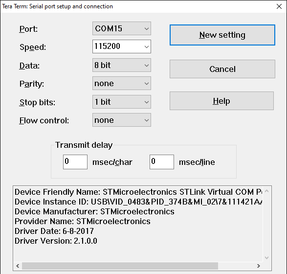

# STSAFE-A Asymmetric cryptography
This project illustrates how to use asymmetric cryptography through STSAFE-A Secure Element using STMicroelectronics Secure Element Library to perform signature verification by STSAFE-A Secure Element. 
When loaded on the target MCU platform, the project generates new key pair through STSAFE-A slot 1.

The example applicative flowchart is illustrated below :

STSELib API & Services used in the example are the following :

- stse_set_default_handler_value
- stse_init
- stse_generate_ecc_key_pair
- stse_ecc_generate_signature

Platforms Services used in the example are the following :

- rng_generate_random_number
- stse_platform_ecc_verify

## Hardware and Software Prerequisites

- [NUCLEO-L452RE - STM32L452RE evaluation board](https://www.st.com/en/evaluation-tools/nucleo-l452re.html)

- [X-NUCLEO-ESE01A1 - STSAFE-A120 Secure element expansion board](https://www.st.com/en/ecosystems/x-nucleo-ese01a1.html)

- [STM32CubeIDE - Integrated Development Environment for STM32](https://www.st.com/en/development-tools/stm32cubeide.html)

- Serial terminal PC software  (i.e. Teraterm)

> [!NOTE]
> If you don't use X-NUCLEO-ESE01A1 board, please refer to section how to adapt the exemple

## Getting started with the project

- Connect the [X-NUCLEO-ESE01A1](https://www.st.com/en/ecosystems/x-nucleo-ese01a1.html) expansion board on the top of the [NUCLEO-L452RE](https://www.st.com/en/evaluation-tools/nucleo-l452re.html) evaluation board.

- Connect the board to the development computer and Open and configure a terminal software as follow (i.e. Teraterm).

- Open the STM32CubeIDE projects located in Application/STM32CubeIDE

- Build the project by clicking the “**Build the active configurations of selected projects\ **” button and verify that no error is reported by the GCC compiler/Linker.

- Launch a debug session then wait the debugger to stop on the first main routine instruction and press Start button to execute the main routine.

> [!NOTE]
> - Power configuation Jumper must be set to 3V3-VCC.
> - The COM port can differ from board to board. Please refer to windows device manager.

<b>Result</b> :

This project reports execution log through the on-board STLINK CDC bridge.
These logs can be analyzed on development computer using a serial terminal application (i.e.: Teraterm).
As example below.

<pre>
----------------------------------------------------------------------------------------------------------------
-                                  STSAFE-A120 asymmetric cryptography                                         -
----------------------------------------------------------------------------------------------------------------
- This example illustrates how to generate a NIST-P256 key pair through STSAFE-A120 slot number 1              -
- and use it to generate and verify a signature generated over a challenge using the key pair                  -
----------------------------------------------------------------------------------------------------------------

 - stse_set_default_handler_value : success
 - Initialize target STSAFE-A120

 - stse_init : success

 - stse_generate_ecc_key_pair : success
         o public key :
  0x0C 0x76 0xB3 0x61 0x05 0x39 0x42 0xF2 0x9D 0x67 0x6B 0x79 0x1E 0xBF 0x81 0x69
  0xFE 0x04 0x51 0xE8 0x54 0x07 0x73 0xB6 0x79 0xAD 0xE4 0xA5 0xA8 0x58 0xE9 0x55
  0x11 0xA0 0x52 0x21 0xC4 0x0E 0x6E 0xDF 0xB1 0xF3 0xDE 0x42 0x09 0xB0 0xA3 0x75
  0x94 0x0C 0xBD 0x3A 0x74 0x4E 0x3A 0xA4 0xAD 0x89 0x7C 0x21 0x0E 0xB2 0x57 0xE7

         o Plain-text challenge :
  0xB0 0x2B 0xB9 0x35 0xF7 0x85 0xF7 0x4F 0x28 0xA2 0x68 0x2A 0x86 0x5B 0x2D 0xC6
  0x49 0xB5 0x4F 0x7F 0xB6 0xA6 0xBA 0x30 0xF1 0x0E 0x32 0x1C 0x88 0xAD 0xA9 0xA7

 - stse_ecc_generate_signature : success
         o signature :
  0x68 0xE3 0x93 0xF6 0xA8 0x38 0x85 0xC3 0xD0 0x2D 0x14 0xE3 0xC8 0x21 0x06 0xA8
  0x6B 0x80 0xC7 0x3D 0x37 0x44 0xE9 0xAC 0x7A 0xD7 0x15 0x3E 0x33 0x38 0xC4 0x9B
  0xE3 0x1E 0x9D 0xEF 0x44 0x6B 0x5B 0xE5 0x8B 0x07 0xE6 0x5C 0x96 0x66 0xB5 0x12
  0x21 0xD0 0x3F 0x7F 0x65 0x4C 0xD0 0xE4 0x70 0x03 0xA7 0xF6 0x5E 0x83 0xCF 0x33

 - stse_platform_ecc_verify : signature validated
</pre>

 ## How to adapt the exemple

 Each STSE handler contains SE's informations mandatory by the STSELib to manage correctly targeted API and services.
-	device_type : STSAFE-A100/ STSAFE-A110/ STSAFE-A120
-	pPersoInfo  : pointer to a specific device perso configuration
-	pActive_host_session : active host session managed by the open session API set
-	pActive_other_session : other session managed by the open session API set.
-	Io : communication bus description like I2C device address , I2C speed
